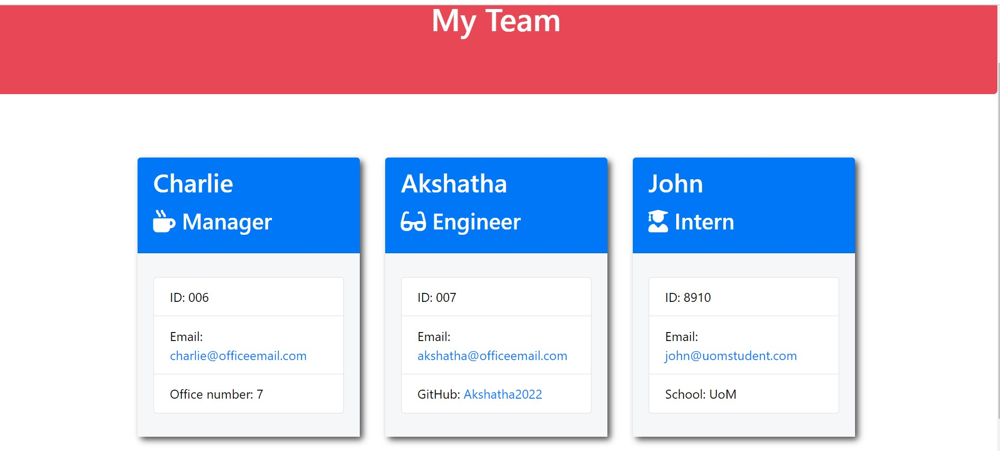

User Story

AS A manager

I WANT to generate a webpage that displays my team's basic info
SO THAT I have quick access to their emails and GitHub profiles

Acceptance Criteria

GIVEN a command-line application that accepts user input

WHEN I am prompted for my team members and their information

THEN an HTML file is generated that displays a nicely formatted team roster based on user input

WHEN I click on an email address in the HTML

THEN my default email program opens and populates the TO field of the email with the address

WHEN I click on the GitHub username

THEN that GitHub profile opens in a new tab

WHEN I start the application

THEN I am prompted to enter the team manager’s name, employee ID, email address, and office number

WHEN I enter the team manager’s name, employee ID, email address, and office number

THEN I am presented with a menu with the option to add an engineer or an intern or to finish building my team

WHEN I select the engineer option

THEN I am prompted to enter the engineer’s name, ID, email, and GitHub username, and I am taken back to the menu

WHEN I select the intern option

THEN I am prompted to enter the intern’s name, ID, email, and school, and I am taken back to the menu

WHEN I decide to finish building my team

THEN I exit the application, and the HTML is generated

Getting Started

My application will use Jest for running the unit tests and Inquirer for collecting input from the user. The application will be invoked by using the following command:

node index.js

It is recommended that you start with a directory structure that looks like this:

.
├── __tests__/             //jest tests
│   ├── Employee.test.js
│   ├── Engineer.test.js
│   ├── Intern.test.js
│   └── Manager.test.js
├── dist/                  // rendered output (HTML) and CSS style sheet      
├── lib/                   // classes
├── src/                   // template helper code 
├── .gitignore             // indicates which folders and files Git should ignore
├── index.js               // runs the application
└── package.json           

And also to install inquirer, I used 'npm i inquirer@8.2.4'

This application includes `Employee`, `Manager`, `Engineer`, and `Intern` classes. The tests for these classes (in the `_tests_` directory) ALL pass.

The first class is an `Employee` parent class with the following properties and methods:

* `name`

* `id`

* `email`

* `getName()`

* `getId()`

* `getEmail()`

* `getRole()`&mdash;returns `'Employee'`

The other three classes will extend `Employee`.

In addition to `Employee`'s properties and methods, `Manager` will also have the following:

* `officeNumber`

* `getRole()`&mdash;overridden to return `'Manager'`

In addition to `Employee`'s properties and methods, `Engineer` will also have the following:

* `github`&mdash;GitHub username

* `getGithub()`

* `getRole()`&mdash;overridden to return `'Engineer'`

In addition to `Employee`'s properties and methods, `Intern` will also have the following:

* `school`

* `getSchool()`

* `getRole()`&mdash;overridden to return `'Intern'`

Screenshot: 

Screenshot of the info added in the video link 

Video Link: Because this is a command-line application won’t be deployed, here is a <a href="https://drive.google.com/file/d/1lrtYsT5ef08NHKKLlPRqJ1wNyVzLp2g0/view" target="_blank">Link</a> to a video walkthrough that demonstrates the functionality of my application.

[Repo Link](https://github.com/Akshatha2022/TeamProfileGenerator)

Sample Team Profile <a href= "file:///C:/Users/aksha/Downloads/TeamProfileGenerator/output/index.html">Link</a>

Resources:

[1] [npm-err-missing-script-start](https://itsjavascript.com/npm-err-missing-script-start)

[2] [cant-get-data](https://stackoverflow.com/questions/70596519/cant-get-data-to-generator-page-in-node-js)

[3] [inquirer](https://www.npmjs.com/package/inquirer/v/8.2.4)

[4] [Jest Package](https://www.npmjs.com/package/jest)

[5] [Node Module](https://stackoverflow.com/questions/47083351/node-module-not-found)

[6] [Generate Readme](https://www.npmjs.com/package/generate-readme)

[7] [Professional Readme](https://coding-boot-camp.github.io/full-stack/github/professional-readme-guide)

[8] [Video Submission Guide](https://coding-boot-camp.github.io/full-stack/computer-literacy/video-submission-guide)

